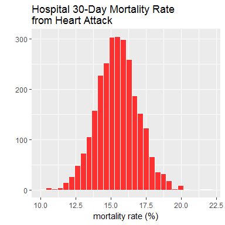

# assignment 3
DanielH  
July 7, 2017  


###Introduction 

The data for this assignment come from the Hospital Compare web site (http://hospitalcompare.hhs.gov) run by the U.S. Department of Health and Human Services. The purpose of the web site is to provide data and information about the quality of care at over 4,000 Medicare-certified hospitals in the U.S. This dataset essentially covers all major U.S. hospitals. This dataset is used for a variety of purposes, including determining whether hospitals should be fined for not providing high quality care to patients.

The Hospital Compare web site contains a lot of data and we will only look at a small subset for this assignment. The zip file for this assignment contains three files:

* _outcome-of-care-measures.csv_: Contains information about 30-day mortality and readmission rates for heart attacks, heart failure, and pneumonia for over 4,000 hospitals.
* _hospital-data.csv_: Contains information about each hospital.
* _Hospital_Revised_Flatfiles.pdf_: Descriptions of the variables in each file (i.e the code book).

A description of the variables in each of the files is in the included PDF file named Hospital_Revised_Flatfiles.pdf. This document contains information about many other files that are not included with this programming assignment. You will want to focus on the variables for Number 19 ("Outcome of Care Measures.csv") and Number 11 ("Hospital Data.csv"). You may find it useful to print out this document (at least the pages for Tables 19 and 11) to have next to you while you work on this assignment. In particular, the numbers of the variables for each table indicate column indices in each table (i.e. "Hospital Name" is column 2 in the outcome-of-care-measures.csv file).

---


##Part 1: plot the 30-day mortality rates for heart attack


Make a simple histogram of the 30-day death rates from heart attack (column 11 in the outcome dataset)


```r
outcome %>%
  mutate(`Hospital 30-Day Death (Mortality) Rates from Heart Attack` =
          as.numeric(`Hospital 30-Day Death (Mortality) Rates from Heart Attack`)) %>%
  ggplot(aes(`Hospital 30-Day Death (Mortality) Rates from Heart Attack`)) +
  geom_histogram(fill = "firebrick1", 
                 color = "white") +
  labs(title = "Hospital 30-Day Mortality Rate \nfrom Heart Attack",
       x = "mortality rate (%)",
       y = "") 
```




##Part 2: finding the best hospital in a state

Write a function called best that take two arguments: the 2-character abbreviated name of a state and an outcome name. The function reads the outcome-of-care-measures.csv file and returns a character vector with the name of the hospital that has the best (i.e. lowest) 30-day mortality for the specified outcome in that state. The hospital name is the name provided in the Hospital.Name variable. The outcomes can be one of "heart attack", "heart failure", or "pneumonia". Hospitals that do not have data on a particular outcome should be excluded from the set of hospitals when deciding the rankings.

The function should check the validity of its arguments.

* _If an invalid state value is passed_ to best, the function should throw an error via the stop function with the exact _message "invalid state"_. 
* _If an invalid outcome value is passed_ to best, the function should throw an error via the stop function with the exact _message "invalid outcome"_.


```r
# define function
best <- function(state, outcome) {

  data2 <- 
    read_csv("outcome-of-care-measures.csv") %>%
    select(2, 7, 11, 17, 23)
  colnames(data2) <- c("hospital", "State",
                       "heart attack",
                       "heart failure", "pneumonia")
  data2 <- 
    data2 %>%
    mutate_each(funs(as.numeric), `heart attack`,
                `heart failure`, `pneumonia`)
  
  state <- enquo(state)
  outcome <- enquo(outcome)
  data2 %>%
    arrange(State, !!outcome, hospital) %>%
    group_by(State) %>%
    summarize(hospital = hospital[1],
              rank = first(!!outcome)) %>%
    filter(State == !!state) %>%
    select(hospital)

}

# test function
best("TX", `heart attack`)
```

```
## # A tibble: 1 x 1
##                           hospital
##                              <chr>
## 1 CYPRESS FAIRBANKS MEDICAL CENTER
```

```r
best("TX", `heart failure`)
```

```
## # A tibble: 1 x 1
##                     hospital
##                        <chr>
## 1 FORT DUNCAN MEDICAL CENTER
```

```r
best("MD", pneumonia)
```

```
## # A tibble: 1 x 1
##                           hospital
##                              <chr>
## 1 GREATER BALTIMORE MEDICAL CENTER
```


## Part3: ranking hospitals by outcome in a state

Write a function called _rankhospital()_ that takes three arguments: the 2-character abbreviated name of a state (state), an outcome (outcome), and the ranking of a hospital in that state for that outcome (num). The function reads the outcome-of-care-measures.csv file and returns a character vector with the name of the hospital that has the ranking specified by the num argument

_rankhospital("MD", "heart failure", 5)_ would return a character vector containing the name of the hospital with the 5th lowest 30-day death rate for heart failure.


```r
# define function
rankhospital <- function(state, outcome, num = "best") {
  
  data2 <- 
    read_csv("outcome-of-care-measures.csv") %>%
    select(2, 7, 11, 17, 23)
  colnames(data2) <- c("hospital", "State",
                       "heart attack",
                       "heart failure", "pneumonia")
  data2 <- 
    data2 %>%
    mutate_each(funs(as.numeric), `heart attack`,
                `heart failure`, `pneumonia`)
  
  state <- enquo(state)
  outcome <- enquo(outcome)
  
  if (is.numeric(num)) {
  data2 %>%
    arrange(State, !!outcome, hospital) %>%
    group_by(State) %>%
    summarize(hospital = hospital[num],
              rank = nth(!!outcome, num)) %>%
    filter(State == !!state) %>%
    select(hospital)
  } else if (!is.numeric(num)) {
      if (num == "best") {
        data2 %>%
          arrange(State, !!outcome, hospital) %>%
          drop_na(!!outcome) %>%
          group_by(State) %>%
          summarize(hospital = hospital[1],
                    rank = first(!!outcome)) %>%
          filter(State == !!state) %>%
          select(hospital)
        } else if (num == "worst") {
          data2 %>%
            arrange(State, !!outcome, hospital) %>%
            group_by(State) %>%
            drop_na(!!outcome) %>%
            summarize(hospital = hospital[length(hospital)],
                      rank = last(!!outcome))  %>%
            filter(State == !!state) %>%
            select(hospital)
          } else {
            stop('invalid num')
            }
      }

}

# test function
rankhospital("TX", `heart failure`, 4)
```

```
## # A tibble: 1 x 1
##                 hospital
##                    <chr>
## 1 DETAR HOSPITAL NAVARRO
```

```r
rankhospital("MD", `heart attack`, "worst")
```

```
## # A tibble: 1 x 1
##                    hospital
##                       <chr>
## 1 HARFORD MEMORIAL HOSPITAL
```

```r
rankhospital("MN", `heart attack`, 5000)
```

```
## # A tibble: 1 x 1
##   hospital
##      <chr>
## 1     <NA>
```


## Part 4: ranking hospitals in all states


```r
# define function
rankall <- function(outcome, num = "best"){
  
  data2 <- 
    read_csv("outcome-of-care-measures.csv") %>%
    select(2, 7, 11, 17, 23)
  colnames(data2) <- c("hospital", "State",
                       "heart attack",
                       "heart failure", "pneumonia")
  data2 <- 
    data2 %>%
    mutate_each(funs(as.numeric), `heart attack`,
                `heart failure`, `pneumonia`)

  outcome <- enquo(outcome)
  if (is.numeric(num)) {
    data2 %>%
      arrange(State, !!outcome, hospital) %>%
      group_by(State) %>%
      summarize(hospital = hospital[num],
                rank = nth(!!outcome, num)) %>%
      select(hospital, State)
    } else if (!is.numeric(num)) {
      if (num == "best") {
        data2 %>%
          arrange(State, !!outcome, hospital) %>%
          drop_na(!!outcome) %>%
          group_by(State) %>%
          summarize(hospital = hospital[1],
                    rank = first(!!outcome)) %>%
          select(hospital, State)
        } else if (num == "worst") {
          data2 %>%
            arrange(State, !!outcome, hospital) %>%
            drop_na(!!outcome) %>%
            group_by(State) %>%
            summarize(hospital = hospital[length(hospital)],
                      rank = last(!!outcome)) %>%
            select(hospital, State)
          } else {
            stop('invalid num')
          }
      }

}

# test function
rankall(`heart attack`, 20)
```

```
## # A tibble: 54 x 2
##                               hospital State
##                                  <chr> <chr>
##  1                                <NA>    AK
##  2      D W MCMILLAN MEMORIAL HOSPITAL    AL
##  3   ARKANSAS METHODIST MEDICAL CENTER    AR
##  4 JOHN C LINCOLN DEER VALLEY HOSPITAL    AZ
##  5               SHERMAN OAKS HOSPITAL    CA
##  6            SKY RIDGE MEDICAL CENTER    CO
##  7             MIDSTATE MEDICAL CENTER    CT
##  8                                <NA>    DC
##  9                                <NA>    DE
## 10      SOUTH FLORIDA BAPTIST HOSPITAL    FL
## # ... with 44 more rows
```

```r
tail(rankall(pneumonia, "worst"), 3) 
```

```
## # A tibble: 3 x 2
##                                     hospital State
##                                        <chr> <chr>
## 1 MAYO CLINIC HEALTH SYSTEM - NORTHLAND, INC    WI
## 2                     PLATEAU MEDICAL CENTER    WV
## 3           NORTH BIG HORN HOSPITAL DISTRICT    WY
```

```r
tail(rankall(`heart failure`), 10)
```

```
## # A tibble: 10 x 2
##                                                             hospital State
##                                                                <chr> <chr>
##  1                         WELLMONT HAWKINS COUNTY MEMORIAL HOSPITAL    TN
##  2                                        FORT DUNCAN MEDICAL CENTER    TX
##  3 VA SALT LAKE CITY HEALTHCARE - GEORGE E. WAHLEN VA MEDICAL CENTER    UT
##  4                                          SENTARA POTOMAC HOSPITAL    VA
##  5                            GOV JUAN F LUIS HOSPITAL & MEDICAL CTR    VI
##  6                                              SPRINGFIELD HOSPITAL    VT
##  7                                         HARBORVIEW MEDICAL CENTER    WA
##  8                                    AURORA ST LUKES MEDICAL CENTER    WI
##  9                                         FAIRMONT GENERAL HOSPITAL    WV
## 10                                        CHEYENNE VA MEDICAL CENTER    WY
```


